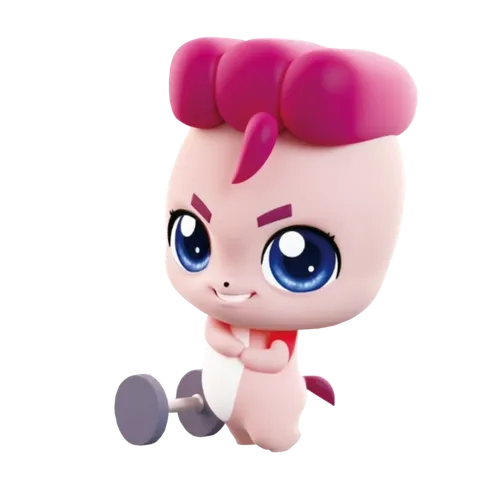
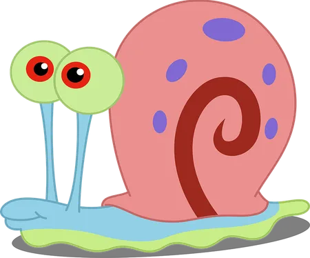
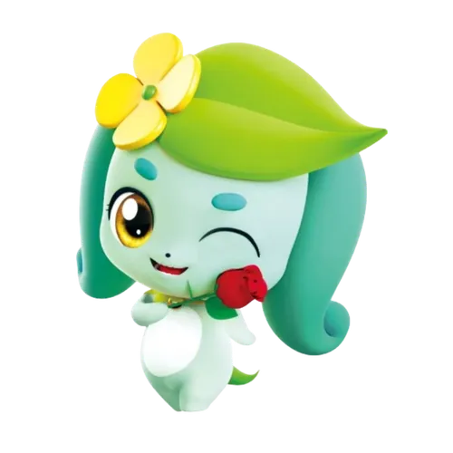
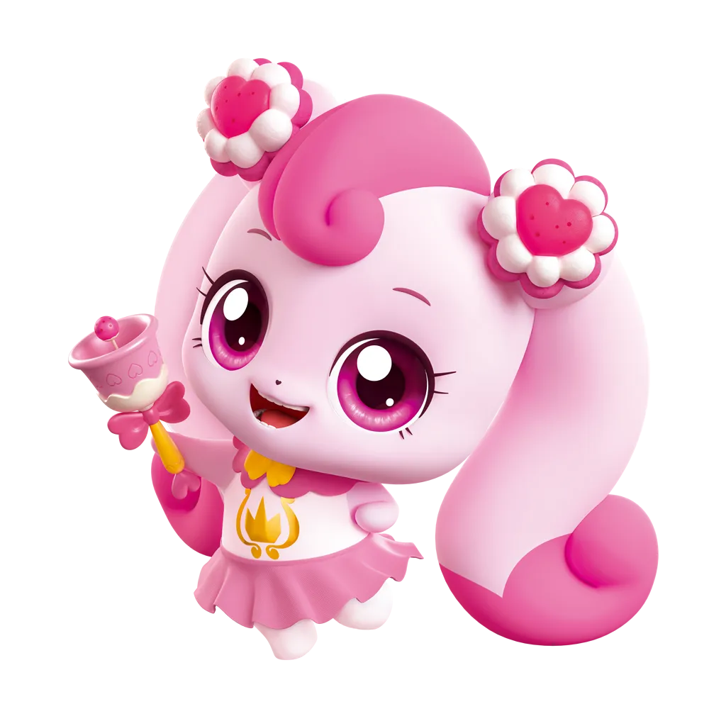
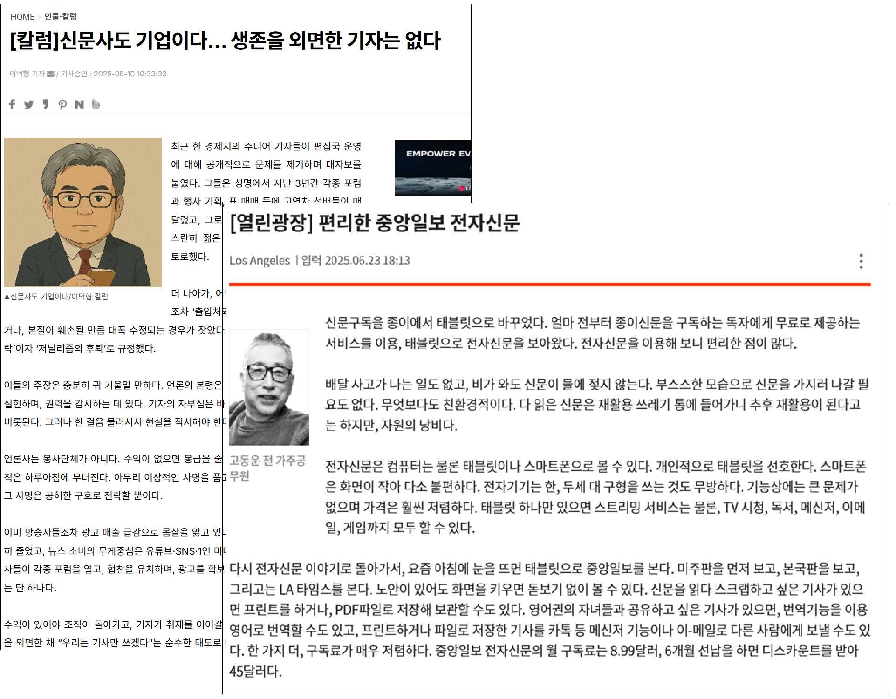

# **SKN17-2ND-5Team**
> SK네트웍스 Family AI 캠프 17기 5팀 2ND PROJECT  
> 개발기간: 25.08.12 - 25.08.12

---
# 📚 Contents

 

1. [Introduce Team](#1-Introduce-Team)
2. [Project Overview](#2-Project-Overview)
3. [Technology Stack & Models](#3-Technology-Stack-&-Models)

 
 

---

# 1. Introduce Team

#### 💡팀명: Hoonibus
#### 💡프로젝트명: 데이터 기반 신문 구독자 이탈 예측
#### 💡팀원 소개:

<table align="center" width="100%">
  <tr>
    <td align="center">
      <a href="https://github.com/Hoonieboogie"><b>@한훈</b></a>
    </td>
    <td align="center">
      <a href="https://github.com/donghyun4957"><b>@최동현</b></a>
    </td>
    <td align="center">
      <a href="https://github.com/happyfrogg"><b>@맹지수</b></a>
    </td>
    <td align="center">
      <a href="https://github.com/Kicangel"><b>@김태완</b></a>
    </td>
    <td align="center">
      <a href="https://github.com/Taeyeon514"><b>@김태연</b></a>
    </td>
  </tr>
  <tr>
    <td align="center"></td>
    <td align="center"></td>
    <td align="center"></td>
    <td align="center"></td>
    <td align="center"></td>
  </tr>
</table>

 

---

# 2. Project Overview

### ✅ 프로젝트 소개
디지털 미디어와 스마트폰 보급, 뉴스 플랫폼과 유튜브 등 영상 기반 채널의 확산으로 뉴스 소비 환경은 급격히 변화했습니다. 실시간·무료·맞춤형 뉴스 콘텐츠를 쉽게 접할 수 있게 되면서, 독자들은 다양한 경로를 통해 정보를 소비하고 있습니다.
따라서, 구독자의 인구통계 정보, 구독 이력, 이용 행태 등의 데이터를 바탕으로 

 

### ✅ 프로젝트 필요성

<table align="center">
  <tr>
    <td align="center">
      
    </td>
  </tr>
</table>

지난 10년 간 반려동물을 키우는 가구 수가 꾸준히 증가하면서 현재 약 600만 가구가 반려동물을 키우고 있을 정도로 관련 시장이 거대해졌습니다.
하지만 커진 시장만큼 반려동물 문제로 어려움을 겪는 보호자도 함께 늘어나고 있습니다.
이러한 문제는 반려동물의 정서뿐 아니라 보호자의 일상과 관계에도 영향을 미칩니다. 그러나 전문적인 행동 교정은 비용과 접근성의 제약으로 누구나 쉽게 이용하기 어렵고,
정보 검색만으로는 개별 상황에 맞는 해결책을 찾기 어렵습니다.
문제는 명확하지만, 이를 일상적으로 해결해줄 개인화된 상담 시스템은 부족한 실정입니다.
이에 따라, 누구나 쉽게 접근할 수 있는 AI 기반 반려견 상담 서비스의 필요성이 커지고 있습니다.

 
 

---

# 3. Technology Stack & Models

## ✅ 기술 스택 및 사용한 모델
