# **SKN17-2ND-5Team**
> SK네트웍스 Family AI 캠프 17기 5팀 2ND PROJECT <br>
> 개발기간: 25.08.12 - 25.08.12

---
# 📚 Contents

<br>

1. [Introduce Team](#1-Introduce-Team)
2. [Project Overview](#2-Project-Overview)
3. [Technology Stack & Models](#3-Technology-Stack-&-Models)
4. [Data Selection & Structure](#4-데이터-선택-및-구조)
5. [Data preprocessing and integration](#5-데이터-전처리-및-통합)
6. [EDA](#6-eda)
7. [Machine Learning](#7-머신러닝)
8. [Limit Point](#8-한계점)
<br>
<br>

---

# 1. Introduce Team

#### 💡 팀명: Hoonibus  
#### 💡팀원 소개:

<table align="center" width="100%">
  <tr>
    <td align="center">
      <a href="https://github.com/Hoonieboogie"><b>@한훈</b></a>
    </td>
    <td align="center">
      <a href="https://github.com/donghyun4957"><b>@최동현</b></a>
    </td>
    <td align="center">
      <a href="https://github.com/happyfrogg"><b>@맹지수</b></a>
    </td>
    <td align="center">
      <a href="https://github.com/Kicangel"><b>@김태완</b></a>
    </td>
    <td align="center">
      <a href="https://github.com/Taeyeon514"><b>@김태연</b></a>
    </td>
  </tr>
  <tr>
    <td align="center"></td>
    <td align="center"></td>
    <td align="center"></td>
    <td align="center"></td>
    <td align="center"></td>
  </tr>
</table>

<br>

---


# 2. Project Overview
### ✅ 프로젝트명: 데이터 기반 신문 구독자 이탈 예측
<br>

### ✅ 프로젝트 소개
본 프로젝트는 전통 언론사가 직면한 구독자 이탈 문제를 데이터 기반으로 해결하고자 합니다.
온라인과 오프라인 신문 구독 데이터를 활용하여 구독자의 이탈 가능성을 예측하고, 이를 바탕으로 맞춤형 유지 전략을 수립함으로써 신문사의 지속 가능한 경영과 경쟁력 확보에 기여하는 것을 목표로 합니다.


<br>

### ✅ 프로젝트 필요성

<table align="center">
  <tr>
    <td align="center">
      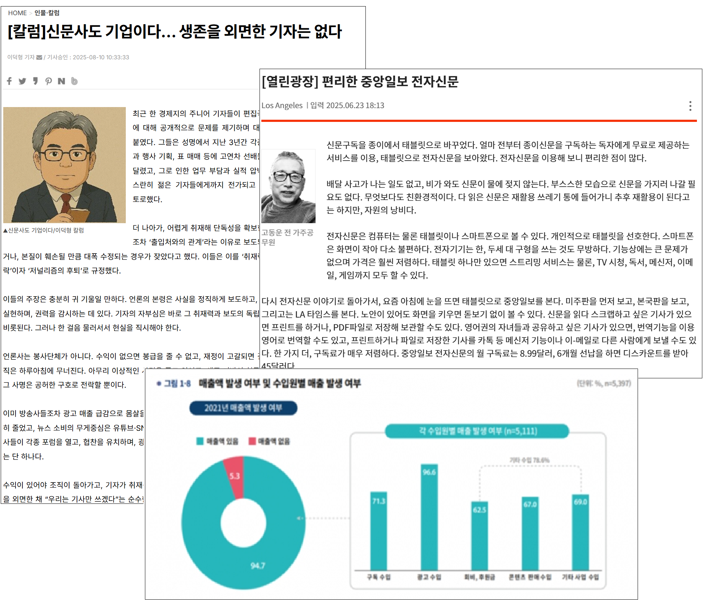
    </td>
  </tr>
</table>

디지털 미디어의 확산으로 신문을 정기적으로 구독하는 인구는 꾸준히 감소하고 있습니다. 스마트폰과 인터넷의 보급, 뉴스 플랫폼과 유튜브 등 동영상 기반 정보 채널의 성장으로, 사람들은 실시간·무료·맞춤형 콘텐츠를 손쉽게 접하게 되었고, 이러한 변화는 정보 소비 패턴을 근본적으로 바꾸어 놓았습니다.

그러나 접근성이 높아진 뉴스가 반드시 양질이라고 볼 수는 없습니다. 신문은 인쇄·편집 등 다단계의 검증 과정을 거치는 반면, 온라인 뉴스는 ‘클릭 수’와 ‘조회 수’에 집중되어 자극적인 제목과 단편적인 내용으로 작성되는 경우가 많습니다. 심층 분석보다는 요약형 기사 위주로 빠르게 소비가 이루어지는 현 상황에서, 사실과 맥락을 깊이 있게 전달하는 전통 언론의 역할은 여전히 필요합니다. 이에 신문사는 현대 사회에서의 존재 이유와 그 역할, 그리고 사업 구조를 재점검해야 하는 시점에 놓여 있습니다.

신문사는 본질적으로 ‘뉴스 생산 기업’이며, 구독료와 광고 수익이 주요 재원입니다. 하지만 전통적인 구독 기반 수익 모델이 붕괴하면서 재정 압박이 가중되고 있습니다. 구독자 수 감소는 매출 하락으로 직결되고, 그 결과 구조조정과 인력 감축이 불가피한 현실이 되고 있습니다.

이러한 상황에서 구독자 이탈을 사전에 예측하고 방지하는 전략은 신문사의 생존과 지속 가능성을 위해 필수적입니다.

따라서 본 프로젝트의 목표인 ‘신문 구독자 이탈 예측’은 단순한 분석을 넘어, 신문사의 지속 가능 경영과 디지털 전환 전략 수립에 실질적으로 기여할 수 있는 핵심 과제입니다. 데이터 기반의 예측 모델을 통해 독자 특성을 면밀히 분석하고, 이탈 요인을 구체적으로 규명함으로써 신문사는 변화하는 미디어 환경 속에서도 경쟁력을 유지하고, 사회적으로도 건강한 정보 전달 체계를 지속할 수 있습니다.
<br>
<br>

### ✅ 프로젝트 목표
- 구독자의 개인 특성을 면밀히 분석하고 이탈 가능성을 예측하는 머신러닝 모델 개발
  - 이탈 위험 구독자를 조기에 식별하여 맞춤형 할인, 콘텐츠 추천 등 유지 전략을 실행할 수 있게 함.
  - 장기적으로 안정적인 구독 기반 확보할 수 있게 함으로써 광고 수익, 브랜드 가치 향상 도모까지 궁극적으로 추구함.

<br>
<br>

---

# 3. Technology Stack & Models

## ✅ 기술 스택 및 사용한 모델

## 🛠️ **기술 스택**

| **분류**   | **기술/도구**                                                                                       |
| **분류**         | **기술/도구**                                                                            |
|------------------|------------------------------------------------------------------------------------------|
| **언어**         |      |
| **라이브러리**   |            <br>  |
| **협업 툴**      |    |

<br>


## 4. 데이터 선택 및 구조

### 4.1 데이터 출처
* 미국 신문 구독자 데이터
- KAGGLE https://www.kaggle.com/datasets/andieminogue/newspaper-churn

<br>

---

### 4.2 데이터 구조

#### **분석 타겟 컬럼**
- `Subcriber` : 구독자 이탈 여부 (분류 대상)

#### **주요 변수**
- `income` : 수입
- `ownership` : 자가 여부
- `ethnicity` : 민족
- `reward program` : 보상혜택 수령 횟수
- `nielsen prizem` : 사회적
- `age range` : 나이
- `deliveryperiod` : 배달 받는 요일
- `year of residence` : 거주기간
- `source channel` : 결제 플랫폼
- `weekly fee` : 주당 구독료

---

## 5. 데이터 전처리 및 통합

- 결측치 및 이상치 처리, 파생변수, 변수명 정제 등 전처리 수행

### 5.1 수치형, 범주형 데이터 조회
```
- 연속형
['SubscriptionID', 'Year Of Residence', 'Zip Code', 'reward program']

- 범주형
['HH Income', 'Home Ownership', 'Ethnicity', 'dummy for Children', 'Age range', 'Language', 'Address', 'State', 'City', 'County', 'weekly fee', 'Deliveryperiod', 'Nielsen Prizm', 'Source Channel', 'Subscriber']
```
### 5.2 파생변수 생성
- 이탈 여부를 0/1 로 변환하여 데이터들 간의 이탈률 여부 분석을 용이하게 하기 위해 ```Subscriber ``` 변수로부터 ```is_churned``` 변수 생성 

### 5.3 결측치 처리
- 결측치 조회
```
SubscriptionID           0
HH Income                0
Home Ownership           0
Ethnicity                0
dummy for Children       0
Year Of Residence        0
Age range              108
Language              1007
Address                  0
State                    0
City                     0
County                   0
Zip Code                 0
weekly fee             186
Deliveryperiod           0
Nielsen Prizm          129
reward program           0
Source Channel           0
Subscriber               0
dtype: int64
```
- 결측치 처리

```age``` ```weekly fee``` ```Neilsen Prizm``` : 결측치 제거

```Language```

- 결측치가 약 6.3%로 상대적으로 큰 수치
- Language 보다 더 중요한 특성들의 행까지 삭제되는 것을 방지할 필요가 있음
- 결측을 'unknown' 처리 했을 때 'unknown' 부류와 아닌 부류의 이탈률에 의미 있는 차이가 없음
- 따라서 안전과 실용적인 측면에서 결측을 'unknown'으로 처리

```Ethnicity ```의 unknown 범주
- Ethnicity 컬럼 중 'unknown' 범주를 가짐
- 해당 범주에 속하는 결측치는 Languge의 결측치와 동일
- Ethnicity 'unknown' 범주 유지 결정

### 5.3 데이터 이상치 조회
- 수치형 변수들 간의 이상치 조회 (```Year Of Residence ```, ```reward program```)
- 거주기간의 경우, 큰 이상치는 존재하지 않으므로 처리하지 않음.
- ```reward program```의 경우 극단치가 존재하지만 할인 관련 혜택을 받는 횟수를 나타내는 특성이고 대부분의 횟수가 0이다 보니 이상치여도 중요한 특성을 담고 있다고 판단하여 처리하지 않음

### 5.4 중복값 제거
- ```Delivery Period``` 에 중복된 범주가 있음(7Day, 7day 등)
- 범주명을 소문자로 변환하여 중복 제거

### 5.5 최종 데이터
- 이탈률과 무관하거나 다른 변수와 중복 특성을 가진 데이터 제거(```SubscriptionID```, ```State```, ```Zip Code```, ```Address```)
- 파생변수 생성에 사용된 변수 제거 (```Subscriber```)
- 최종 변수

```
 #   Column              Non-Null Count  Dtype 
---  ------              --------------  ----- 
 0   HH Income           15438 non-null  object
 1   Home Ownership      15438 non-null  object
 2   Ethnicity           15438 non-null  object
 3   dummy for Children  15438 non-null  object
 4   Year Of Residence   15438 non-null  int64 
 5   Age range           15438 non-null  object
 6   Language            15438 non-null  object
 7   City                15438 non-null  object
 8   County              15438 non-null  object
 9   weekly fee          15438 non-null  object
 10  Deliveryperiod      15438 non-null  object
 11  Nielsen Prizm       15438 non-null  object
 12  reward program      15438 non-null  int64 
 13  Source Channel      15438 non-null  object
 14  is_churned          15438 non-null  int64
```

## 6. EDA

#### 이탈 잔류 전체 비율
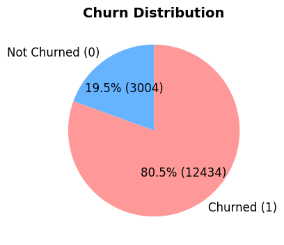
#### 집 소유 여부별 비율 (상대적 이탈률만 비교)

```
카이제곱 P-value: 2.3432e-51
Cramér's V: 0.1213
➡ 통계적으로 유의미한 관련성이 있습니다.
```
#### Ethnicity & Language 별 비율 (상대적 이탈률만 비교)
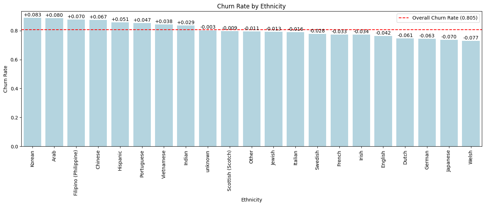
```
카이제곱 P-value: 1.1848e-31
Cramér's V: 0.1164
➡ 통계적으로 유의미한 관련성이 있습니다.
```
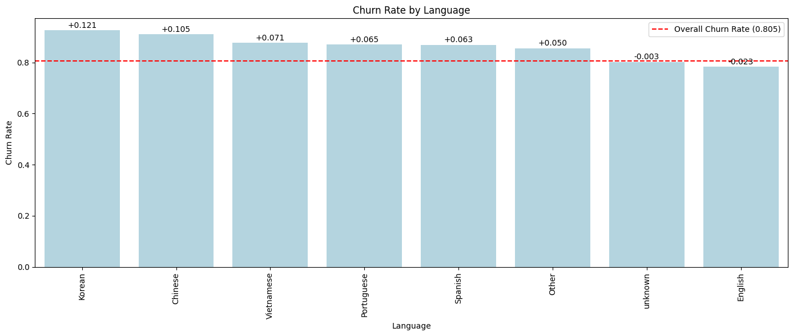
```
카이제곱 P-value: 6.6138e-27
Cramér's V: 0.0953
➡ 통계적으로 유의미한 관련성이 있습니다.
```
#### Age Range 별 이탈률
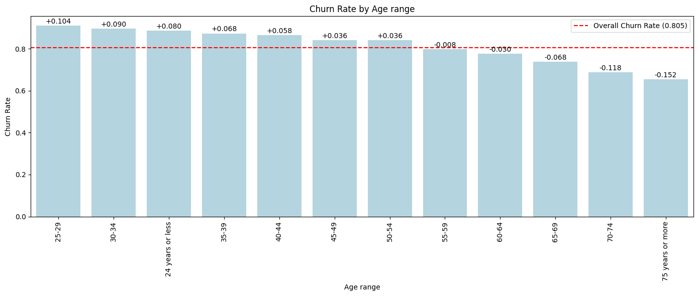
```
카이제곱 P-value: 1.3018e-120
Cramér's V: 0.1964
➡ 통계적으로 유의미한 관련성이 있습니다.
```
#### 소득 구간 별 이탈률
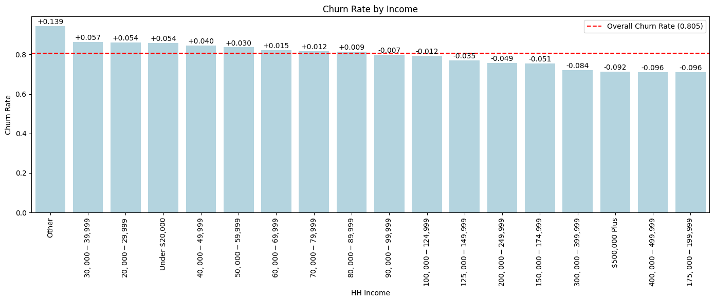
```
카이제곱 P-value: 4.9239e-39
Cramér's V: 0.1210
➡ 통계적으로 유의미한 관련성이 있습니다.
```
#### Source Channel 별
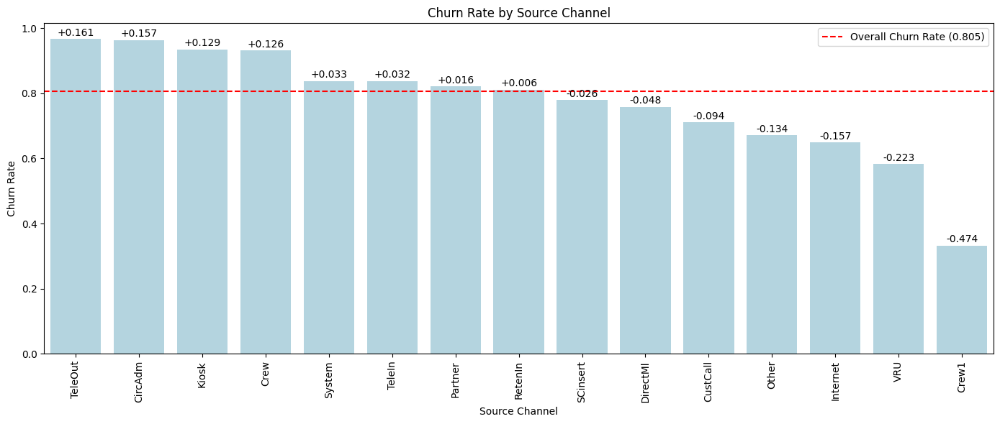
```
카이제곱 P-value: 2.6269e-233
Cramér's V: 0.2710
➡ 통계적으로 유의미한 관련성이 있습니다.
```
#### Delivery Period 별
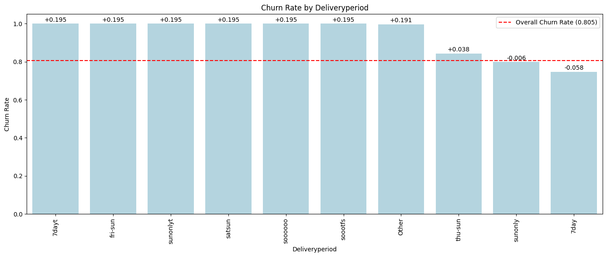
```
카이제곱 P-value: 1.3454e-98
Cramér's V: 0.1771
➡ 통계적으로 유의미한 관련성이 있습니다.
```
#### Dummy for Children
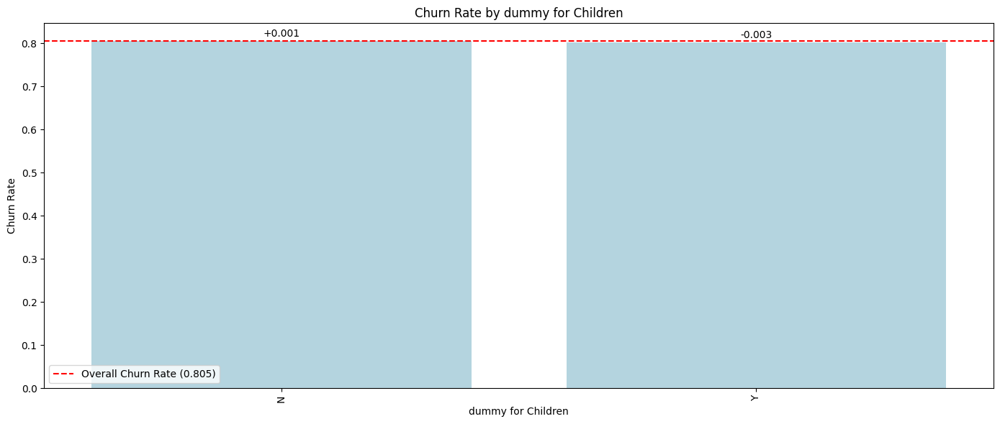
```
카이제곱 P-value: 6.4890e-01
Cramér's V: 0.0037
➡ 통계적으로 유의미한 관련성이 없습니다.
```
- 기타 변수들과의 상관관계 분석(1) - Age

  ```
  - Chi-square test for dummy for Children × Age
  카이제곱 p-value = 1.8784e-116
  ➡ 유의미한 차이가 있음 (p < 0.05)
  ```
- 기타 변수들과의 상관관계 분석(2) - Income
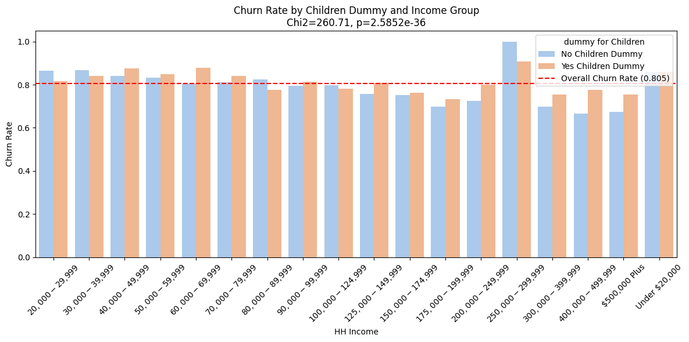
  ```
  Chi-square test for dummy for Children × Income
  카이제곱 p-value = 2.5852e-36
  ➡ 유의미한 차이가 있음 (p < 0.05)
  ```
#### 도시 및 County 별 
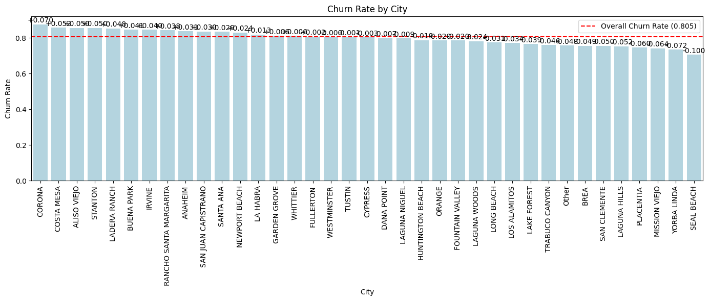
```
카이제곱 P-value: 9.5371e-15
Cramér's V: 0.0964
➡ 통계적으로 유의미한 관련성이 있습니다.
```
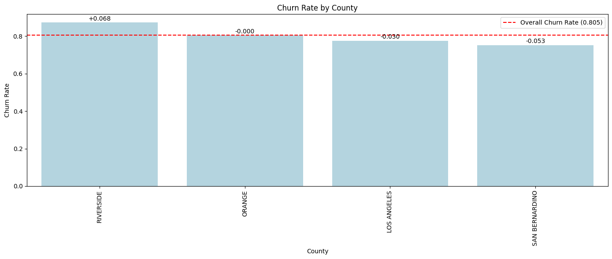
```
카이제곱 P-value: 1.7125e-04
Cramér's V (effect size): 0.0360
➡ 통계적으로 유의미한 관련성이 있습니다.
```
#### weekly fee 별
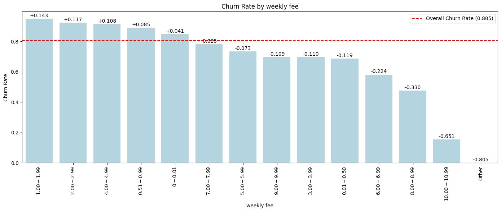
```
카이제곱 P-value: 0.0000e+00
Cramér's V: 0.4133
➡ 통계적으로 유의미한 관련성이 있습니다.
```
#### Nielsen Prizm별
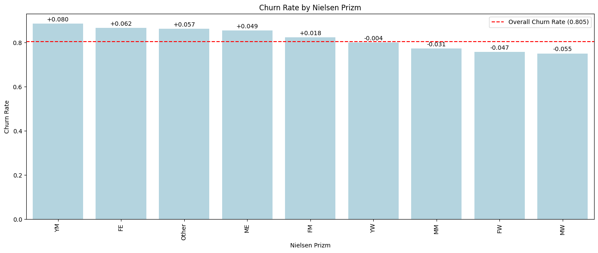
```
카이제곱 P-value: 3.4017e-48
Cramér's V : 0.1257
➡ 통계적으로 유의미한 관련성이 있습니다.
```
#### 거주기간
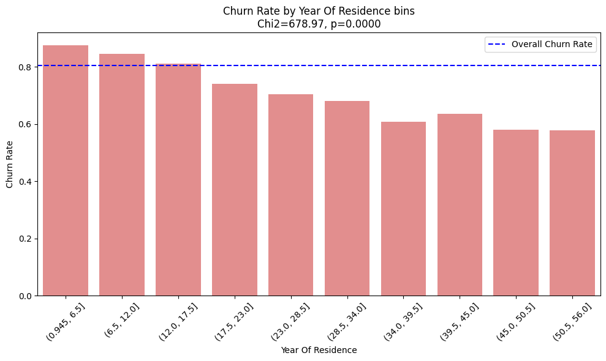
```
카이제곱 P-value: 2.2910e-140
Cramér's V (effect size): 0.2097
➡ 통계적으로 유의미한 관련성이 있습니다.
```
#### 보상 프로그램 획득
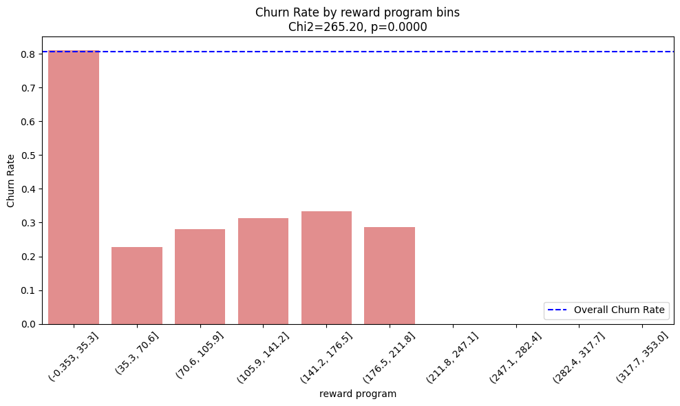
```
카이제곱 P-value: 1.0287e-52
Cramér's V (effect size): 0.1311
➡ 통계적으로 유의미한 관련성이 있습니다.
```

### 얻은 결론
- 카이제곱 검정 결과, ‘Dummy for children’ 변수를 제외한 모든 변수가 이탈과 유의미한 관련성을 보였습니다.
- 기타 변수들과 'Dummy for children'변수와의 상관관계 분석 결과, 유의미한 관련성이 확인되었습니다.
- 따라서, 추가적인 변수 조합 분석의 필요성은 낮다고 판단하여 모든 변수를 모델의 Feature로 사용하기로 결정하였습니다.
<br>

## 7. 머신러닝

### 7.1 학습을 위한 전처리

#### 나이(`Age range`) 및 소득(`HH Income`) 수치형 특성으로 변환 

- 원본 데이터의 **나이**와 **소득**은 구간별 범주형 데이터로 제공됨.  
- 대부분의 머신러닝 알고리즘(특히 scikit-learn)은 입력을 수치형으로 받으므로, 범주형 변수는 모델링 전에 변환 필요(Pedregosa et al., 2011).  
- *Age range*와 *HH Income*은 연속형 변수를 구간화한 서열형(ordinal) 범주임.  
  - 단순 라벨 처리 시 구간 내부의 크기 정보가 손실되고, 모델이 연속적 패턴을 학습하기 어려움.  
  - 실제 값(나이, 달러)로 복원 시, Gradient Boosting 같은 트리 기반 모델이 더 세밀한 분할 경계를 학습 가능(Friedman, 2001; Chen & Guestrin, 2016).  

- **나이 변환(Age)**  
  - 통계학적으로 구간 데이터는 계급 중앙값(class midpoint)으로 추정하는 것이 표준(OpenStax, 2019).  
  - 본 프로젝트에서는 중앙값 대신 절단 정규분포(truncated normal)에서 난수를 추출하는 **확률적 대치(stochastic imputation)** 사용.  
  - 분산 축소 방지 및 변동성 유지에 유리(van Buuren, 2018).  

- **소득 변환(HH Income)**  
  - 소득 분포는 일반적으로 로그 정규분포, 상위 구간은 파레토 분포 꼬리(Aitchison & Brown, 1957; Toda, 2012).  
  - 각 구간의 하한·상한 범위 내에서 로그 정규분포 기반 난수 추출 → 현실적·일관성 있는 값 생성.  

- **변환 장점**  
  - 단순 서열형 인코딩(예: “25–29” → 1, “30–34” → 2)의 인위적 간격 문제 해소(scikit-learn developers, 2024).  
  - 의미 있는 수치값으로 변환해 거리·순서 정보 유지.  
  - 다양한 머신러닝 알고리즘에서 변수 활용성 극대화.  


**<참고 문헌>** 
- Aitchison, J., & Brown, J. A. C. (1957). The lognormal distribution. Cambridge University Press.

- Chen, T., & Guestrin, C. (2016). XGBoost: A scalable tree boosting system. Proceedings of the 22nd ACM SIGKDD International Conference on Knowledge Discovery and Data Mining, 785–794.

- Friedman, J. H. (2001). Greedy function approximation: A gradient boosting machine. Annals of Statistics, 29(5), 1189–1232.

- OpenStax. (2019). Introductory statistics. Rice University.

- Pedregosa, F., Varoquaux, G., Gramfort, A., Michel, V., Thirion, B., Grisel, O., ... & Duchesnay, É. (2011). Scikit-learn: Machine learning in Python. Journal of Machine Learning Research, 12, 2825–2830.

- scikit-learn developers. (2024). Encoding categorical features. Retrieved from https://scikit-learn.org

- Toda, A. A. (2012). The double power law in income distribution: Explanations and evidence. Journal of Economic Behavior & Organization, 84(1), 364–381.

- van Buuren, S. (2018). Flexible imputation of missing data (2nd ed.). CRC Press.

<br>

#### 데이터 불균형 해결 방법

- **데이터 불균형 문제**  
  - 원본 데이터에서 `is_churned=1`이 압도적으로 많음(약 20:80 비율).  
  - 이 상태로 학습 시, 모델이 다수 클래스(1)에만 좋은 성능을 내고, 소수 클래스(0) 예측 성능이 저조해질 가능성이 높음.  

- **해결 방법**  
  - 오버샘플링 기법 **SMOTENC** 도입.  
  - SMOTENC 적용 전, 범주형 데이터 처리를 위해 **라벨 인코딩(Label Encoding)** 수행.  
  - 클래스 불균형 해소를 위해 소수 클래스 샘플을 합성하여 양 클래스 비율을 균등하게 조정.  

- **라벨 인코딩 및 SMOTENC 적용 절차**  
  1. 타깃(`is_churned`)과 피처 분리.  
  2. 범주형(`cat_cols`)과 수치형(`num_cols`) 컬럼 지정 및 실제 존재하는 컬럼만 필터링.  
  3. 범주형 컬럼을 `pd.Categorical(...).codes`로 변환.  
  4. SMOTENC에 전달할 범주형 컬럼 인덱스(`cat_idx`) 생성.  
  5. 소수 클래스 개수를 기반으로 `k_neighbors` 값 설정.  
  6. SMOTENC로 데이터 재샘플링(`fit_resample`).  

- **적용 코드**
```python
  # 타깃 / 피처 분리
  y = converted_df['is_churned'].astype(int)
  X = converted_df.drop(columns=['is_churned']).copy()

  # 범주형 / 수치형 컬럼 지정
  cat_cols = [
      'Home Ownership','Ethnicity','dummy for Children',
      'Language','City','County','weekly fee',
      'Deliveryperiod','Nielsen Prizm','Source Channel'
  ]
  num_cols = ['Year Of Residence', 'reward program', 'Age', 'Income']

  # 실제 존재하는 컬럼만 남기기
  cat_cols = [c for c in cat_cols if c in X.columns]
  num_cols = [c for c in num_cols if c in X.columns]

  # 범주형을 정수 코드로 변환
  X_enc = X.copy()
  for c in cat_cols:
      X_enc[c] = pd.Categorical(X_enc[c]).codes

  # SMOTENC용 범주형 컬럼 인덱스
  cat_idx = [X_enc.columns.get_loc(c) for c in cat_cols]

  # k_neighbors 설정
  class_counts = Counter(y)
  minority_n = min(class_counts.values())
  k_neighbors = max(1, min(5, minority_n - 1))

  # SMOTENC 적용
  smote = SMOTENC(
      categorical_features=cat_idx,
      random_state=42,
      k_neighbors=k_neighbors
  )
  X_res, y_res = smote.fit_resample(X_enc, y)
```

**SMOTENC 적용 후 결과**

| 구분              | 클래스 1 개수 | 클래스 0 개수 |
|-------------------|--------------|--------------|
| 변경 전           | 12,434       | 3,004        |
| 변경 후           | 12,434       | 12,434       |


<br>

### 7.2 머신러닝을 위한 모델 선정 및 사전 학습
각 조원은 하나의 모델을 맡아 총 **5개의 모델**을 구성하였으며,  
`GridSearchCV`를 활용해 다양한 하이퍼파라미터 조합을 탐색하고, 교차 검증을 통해 모델의 일반화 성능을 평가하였습니다.  
각 모델의 최고 성능 결과는 다음과 같습니다.  


1) **XGBoost**

| Class | Precision | Recall | F1-Score | Support |
|-------|-----------|--------|----------|---------|
| 0     | 0.87      | 0.89   | 0.88     | 2,487   |
| 1     | 0.89      | 0.86   | 0.87     | 2,487   |
| **Accuracy**  |           |        | **0.88** | 4,974   |

<br>

2) **Random Forest**

| Class        | Precision | Recall | F1-Score | Support |
|--------------|-----------|--------|----------|---------|
| 0            | 0.87      | 0.87   | 0.87     | 3,109   |
| 1            | 0.87      | 0.87   | 0.87     | 3,108   |
| **Accuracy** |           |        | **0.87** | 6,217   |

<br>

3) **Decision Tree**

| Class        | Precision | Recall | F1-Score | Support |
|--------------|-----------|--------|----------|---------|
| 0            | 0.79      | 0.84   | 0.82     | 2,487   |
| 1            | 0.83      | 0.78   | 0.81     | 2,487   |
| **Accuracy** |           |        | **0.81** | 4,974   |

<br>

4) **SVM**

| Class        | Precision | Recall | F1-Score | Support |
|--------------|-----------|--------|----------|---------|
| 0            | 0.565     | 0.527  | 0.545    | 3,143   |
| 1            | 0.547     | 0.585  | 0.566    | 3,074   |
| **Accuracy** |           |        | **0.556**| 6,217   |

<br>

5) **Gradient Boosting**

| Class        | Precision | Recall | F1-Score | Support |
|--------------|-----------|--------|----------|---------|
| 0            | 0.89      | 0.89   | 0.89     | 2,487   |
| 1            | 0.89      | 0.89   | 0.89     | 2,487   |
| **Accuracy** |           |        | **0.89** | 4,974   |

<br>

**결론:**  
다섯 모델의 성능 비교 결과, **Gradient Boosting**이 가장 높은 정확도와 균형 잡힌 성능을 보여 최종 모델로 선정하였습니다.

<br>

### 7.3 최종 모델 성능 고도화

최종 모델로 선정된 **Gradient Boosting**의 최적 하이퍼파라미터 조합은 다음과 같습니다.

| Hyperparameter | Value  |
|----------------|--------|
| learning_rate  | 0.225  |
| max_depth      | 8      |
| n_estimators   | 400    |
| subsample      | 0.95   |

해당 파라미터를 기반으로, 모델 성능을 더욱 고도화하기 위해 **추가적인 수동 하이퍼파라미터 및 임계치(Threshold) 조정**을 진행하였고, 그 결과 성능이 유의미하게 향상되었습니다.

**Best Threshold:** 0.32  
**Macro F1:** 0.8900  

| Class        | Precision | Recall | F1-Score | Support |
|--------------|-----------|--------|----------|---------|
| 0            | 0.90      | 0.88   | 0.89     | 2,487   |
| 1            | 0.88      | 0.90   | 0.89     | 2,487   |
| **Accuracy** |           |        | **0.89** | 4,974   |

<br>


---

추가적으로, **SMOTENC 오버샘플링의 효과를 검증**하기 위해 전처리 및 인코딩을 거친 **원본 데이터(오버샘플링 미적용)**를 동일한 모델에 학습시켜 비교 실험을 진행했습니다.

**Best Threshold:** 0.62  
**Macro F1:** 0.7090  

| Class        | Precision | Recall | F1-Score | Support |
|--------------|-----------|--------|----------|---------|
| 0            | 0.62      | 0.44   | 0.51     | 601     |
| 1            | 0.87      | 0.94   | 0.90     | 2,487   |
| **Accuracy** |           |        | **0.84** | 3,088   |

---
<br>

**결론:**  
- 오버샘플링 미적용 시, **전체 정확도(Accuracy)** 는 0.84로 비교적 높게 유지되었으나, 소수 클래스(`is_churned = 0`)에 대한 **Recall** 과 **F1-Score** 가 크게 하락.  
- 반면, SMOTENC 적용 시 소수 클래스 예측력이 크게 개선되었으며, 전체적인 Macro F1 점수도 향상됨.  
- 이를 통해 **오버샘플링 적용 전략이 소수 클래스 예측 성능 향상에 효과적임**을 검증함.

<br> 

### 7.4 최적 모델 성능에 대한 고찰


## 8. 한계점
- 캐글데이터 쓴거 -> 실제 raw가 아니다보니 데이터 관련성이 미리 설계되었을 가능성
- smote -> 라이브러리에 의존한 무지성 증강. 증강에 대한 사전평가 아쉽다

Oversampling 방식의 한계

사용된 SMOTENC는 학습 데이터에서 관측된 국소적 분포를 기반으로 데이터를 생성하기 때문에 실제 모집단 분포를 보장하지 못함. 또한, 클래스 경계 부근의 노이즈나 범주형 변수 조합의 비현실성으로 인해 모델의 일반화 성능이 저하될 가능성이 큼. 따라서 적용 이후에 원래 데이터와 비교했을 때의 대비 단·다변량 분포와 생성된 데이터의 검증이 필요.

시간적 제약
모델 학습중 SVM의 하이퍼 파라미터 탐색이 약 900분에 달하면서 최적의 하이퍼파라미터에 도달하지 못한 아쉬움이 남았다. 모델의 성능을 더 끌어 올릴 수 있는데도 불구하고, 시간적 제약 때문에 최고의 성능을 찾지 못해 지속적인 하이퍼파라미터 업데이트 등에 대한 보완이 필요하다
- 광범위한 하이퍼파라미터 튜닝 -> 7.3 성능 고도화 단계에서 훨씬 성능이 증가한 경우도 봤다. (시간 제약, 서포트벡터머신 900분)
