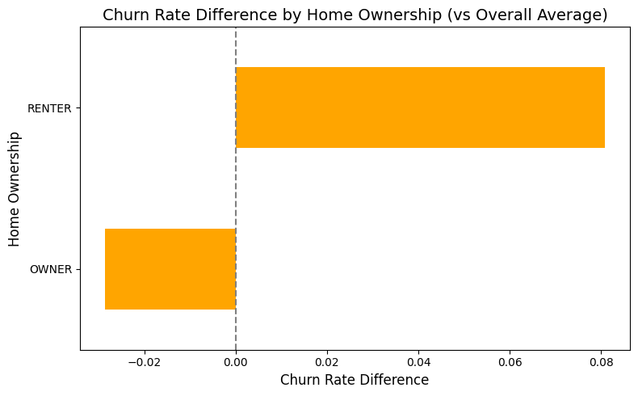
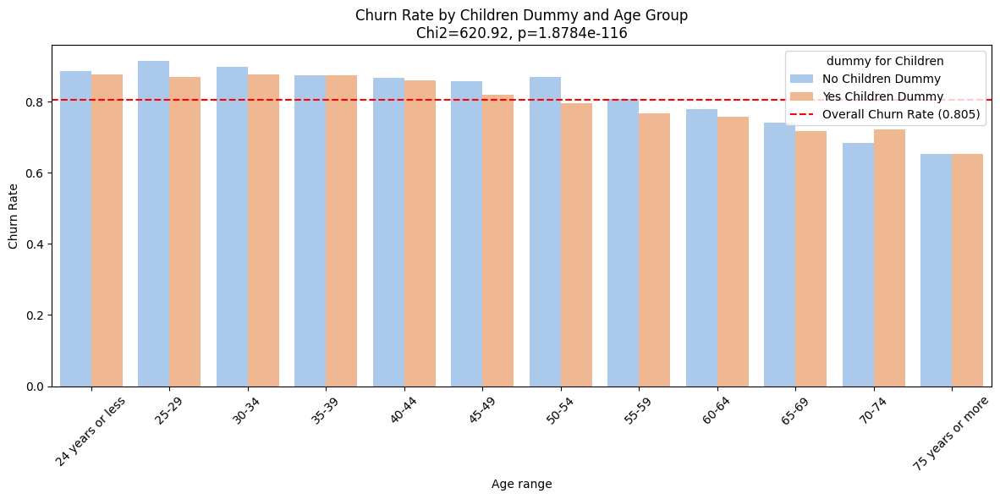
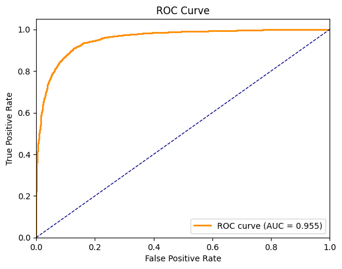
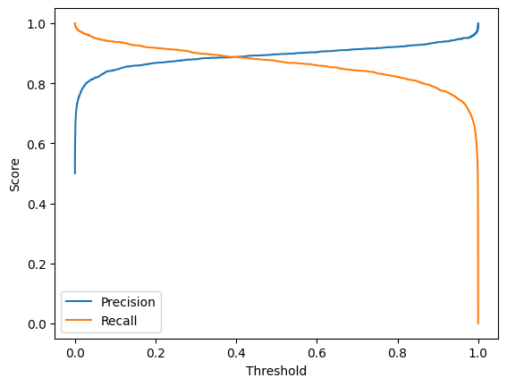
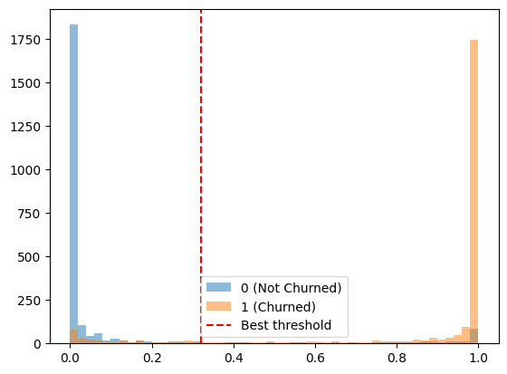
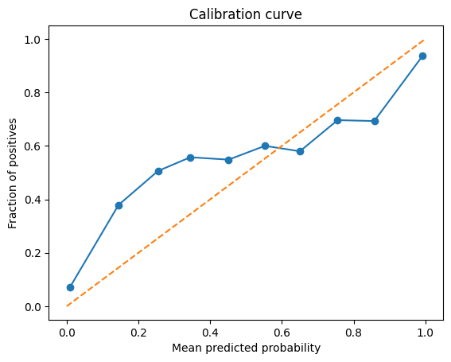
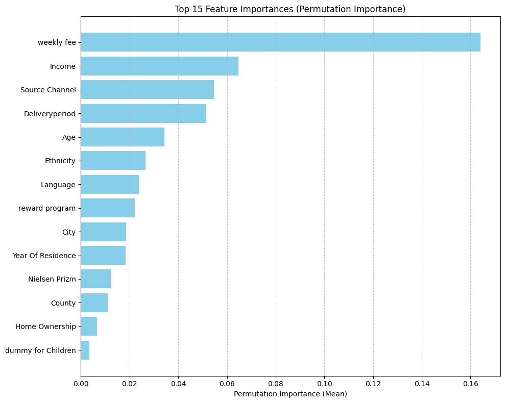
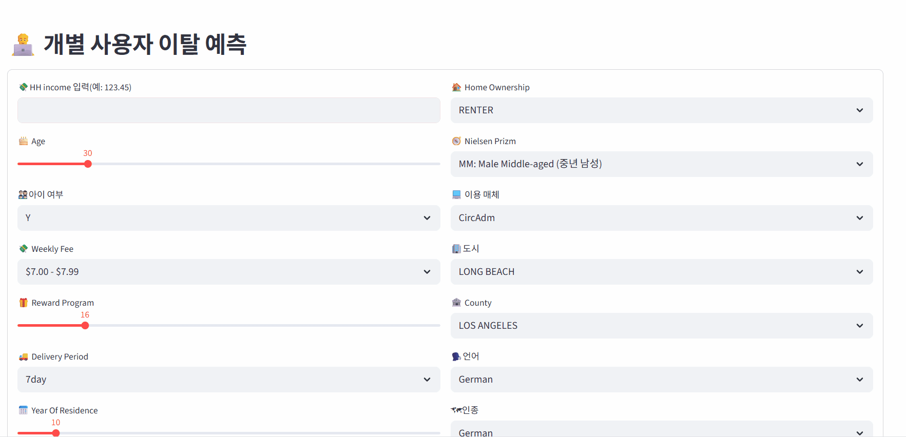

# **Stop the Churn: 데이터로 잡는 신문 구독자**
> SK네트웍스 Family AI 캠프 17기 5팀 2ND PROJECT <br>
> 개발기간: 25.08.11 - 25.08.12

---
# 📚 Contents

<br>

1. [Team Introduction](#1-Introduce-Team)
2. [Project Overview](#2-Project-Overview)
3. [Technology Stack & Models](#3-Technology-Stack-&-Models)
4. [Data Selection & Structure](#4-데이터-선택-및-구조)
5. [Data preprocessing and integration](#5-데이터-전처리-및-통합)
6. [EDA](#6-eda)
7. [Machine Learning](#7-머신러닝)
8. [Limit Point](#8-한계점)
9. [Streamlit Page](#9-시연페이지)
<br>
<br>

---

# 1. Team Introduction

#### 💡 팀명:  
#### 💡팀원 소개:

<table align="center" width="100%">
  <tr>
    <td align="center">
      <a href="https://github.com/Hoonieboogie"><b>@한훈</b></a>
    </td>
    <td align="center">
      <a href="https://github.com/donghyun4957"><b>@최동현</b></a>
    </td>
    <td align="center">
      <a href="https://github.com/happyfrogg"><b>@맹지수</b></a>
    </td>
    <td align="center">
      <a href="https://github.com/Kicangel"><b>@김태완</b></a>
    </td>
    <td align="center">
      <a href="https://github.com/Taeyeon514"><b>@김태연</b></a>
    </td>
  </tr>
  <tr>
    <td align="center"></td>
    <td align="center"></td>
    <td align="center"></td>
    <td align="center"></td>
    <td align="center"></td>
  </tr>
</table>

<br>

---


# 2. Project Overview

### ✅ 프로젝트 소개
- 본 프로젝트는 **전통 언론사가 직면한 구독자 이탈 문제**를 데이터 기반으로 해결하는 것을 목표로 함.  

- 온라인 및 오프라인 신문 구독 데이터를 분석하여 **구독자의 이탈 가능성**을 예측하고, 그 결과를 바탕으로 **맞춤형 유지 전략**을 수립함으로써, 신문사의 **지속 가능한 경영**과 **경쟁력 강화**에 기여하고자 함.


<br>

### ✅ 프로젝트 필요성

<table align="center">
  <tr>
    <td align="center">
      
    </td>
  </tr>
</table>

- **신문 구독 감소 추세**
  - 디지털 미디어 확산으로 정기 구독 인구 지속 감소.
  - 스마트폰·인터넷 보급, 뉴스 플랫폼·유튜브 등 영상 기반 채널 성장.
  - 실시간·무료·맞춤형 콘텐츠 접근성 증가로 정보 소비 패턴 변화.

- **온라인 뉴스와 전통 신문의 차이**
  - **신문**: 인쇄·편집 등 다단계 검증 과정을 거침.
  - **온라인 뉴스**: 클릭 수·조회 수 중심, 자극적인 제목·단편적 내용 빈번.
  - 심층 분석보다 요약형 기사 위주로 빠르게 소비되는 경향.
  - 전통 언론의 사실·맥락 전달 역할은 여전히 필요.

- **신문사의 현황과 과제**
  - 신문사는 뉴스 생산 기업이며, 구독료와 광고 수익이 주요 재원.
  - 전통 구독 기반 수익 모델 붕괴 → 재정 압박 심화.
  - 구독자 감소 → 매출 하락 → 구조조정·인력 감축 불가피.
  - 현대 사회에서 존재 이유·역할·사업 구조 재점검 필요.

- **구독자 이탈 예측의 필요성**
  - 구독자 이탈 방지 전략은 신문사의 생존과 지속 가능성에 필수.
  - 이탈 예측은 단순 분석을 넘어 디지털 전환 및 지속 가능 경영 전략에 기여.


<br>

### ✅ 프로젝트 목표
  - 데이터 기반으로 이탈 위험 구독자를 조기에 식별하여 맞춤형 할인, 콘텐츠 추천 등 유지 전략을 실행할 수 있게 함.
  - 장기적으로 안정적인 구독 기반 확보할 수 있게 함으로써 변화하는 미디어 환경 속에서 경쟁력을 유지할 수 있게 함.
  - 건강한 정보 전달 체계 유지로 사회적 기여를 할 수 있게 함.

<br>
<br>

---

# 3. Technology Stack & Models

## 🛠️ **기술 스택**

| **분류**         | **기술/도구**                                                                            |
|------------------|------------------------------------------------------------------------------------------|
| **언어**         |      |
| **라이브러리**   |            <br>   <br> |
| **협업 툴**      |    |

<br>
<br>

# 4. 데이터 선택 및 구조

### 4.1 데이터
- 캘리포니아 신문 구독자 데이터
- 출처: https://www.kaggle.com/datasets/andieminogue/newspaper-churn

<br>

---

### 4.2 데이터 구조

#### **분석 타겟 컬럼**
- `Subcriber` : 구독자 이탈 여부 (분류 대상)

#### **주요 변수**
- `SubscriptionID` : 구독자 고유 ID  
- `HH Income` : 가구 수입  
- `Home Ownership` : 주거 형태(자가/임대 여부)  
- `Ethnicity` : 민족  
- `dummy for Children` : 자녀 유무 더미 변수  
- `Year Of Residence` : 현재 거주 기간(연 단위)  
- `Age range` : 나이 구간  
- `Language` : 사용 언어  
- `Address` : 주소  
- `State` : 주(state)  
- `City` : 도시  
- `County` : 행정구역  
- `Zip Code` : 우편번호  
- `weekly fee` : 주당 구독료  
- `Deliveryperiod` : 배달 요일 또는 배달 주기  
- `Nielsen Prizm` : 인구통계 세분화 모델 코드  
- `reward program` : 보상 프로그램 수령 횟수  
- `Source Channel` : 유입 경로  

<br>

---

## 5. 데이터 전처리 및 통합

- 결측치 및 이상치 처리, 파생변수, 변수명 정제 등 전처리 수행.

### 5.1 수치형, 범주형 데이터 조회
연속형
```
['SubscriptionID', 'Year Of Residence', 'Zip Code', 'reward program']
```
범주형
```
['HH Income', 'Home Ownership', 'Ethnicity', 'dummy for Children', 'Age range', 'Language', 'Address', 'State', 'City', 'County', 'weekly fee', 'Deliveryperiod', 'Nielsen Prizm', 'Source Channel', 'Subscriber']
```
### 5.2 파생변수 생성
- 이탈 여부를 0/1 로 변환하여 데이터들 간의 이탈률 여부 분석을 용이하게 하기 위해 ```Subscriber``` 변수로부터 ```is_churned``` 변수 생성.

### 5.3 결측치 처리
- 결측치 조회
```
SubscriptionID           0
HH Income                0
Home Ownership           0
Ethnicity                0
dummy for Children       0
Year Of Residence        0
Age range              108
Language              1007
Address                  0
State                    0
City                     0
County                   0
Zip Code                 0
weekly fee             186
Deliveryperiod           0
Nielsen Prizm          129
reward program           0
Source Channel           0
Subscriber               0
dtype: int64
```
- 결측치 처리

```age``` ```weekly fee``` ```Neilsen Prizm``` : 결측치 제거.

```Language```

- 결측치가 약 6.3%로 상대적으로 큰 수치.
- Language 보다 더 중요한 특성들의 행까지 삭제되는 것을 방지할 필요가 있음.
- 결측을 'unknown' 처리 했을 때 'unknown' 부류와 아닌 부류의 이탈률에 의미 있는 차이가 없음.
- 따라서 안전과 실용적인 측면에서 결측을 'unknown'으로 처리.

```Ethnicity```의 'unknown' 범주
- Ethnicity 컬럼 중 'unknown' 범주가 존재.
- Language가 결측인 데이터들은 항상 Ethnicity 범주가 'unknown'임을 발견.
- 위와 마찬가지 이유로 Ethnicity 'unknown' 범주 제거 대신 유지 결정.

### 5.3 데이터 이상치 조회
- 수치형 변수들 간의 이상치 조회 (```Year Of Residence```, ```reward program``` 등).
- ```Year Of Residence``` 경우, 큰 이상치는 존재하지 않으므로 처리하지 않음.
- ```reward program```의 경우 극단치가 존재하지만, 할인 관련 혜택을 받는 횟수를 나타내는 특성이고 대부분의 횟수가 0이다 보니, 이상치임에도 중요한 특성을 담고 있다고 판단하여 처리하지 않음.

### 5.4 중복값 제거
- ```Delivery Period``` 에 중복된 범주가 있음 (7Day, 7day 등).
- 범주명을 소문자로 변환하여 중복 제거.

### 5.5 최종 데이터
- 이탈률과 무관하거나 다른 변수와 중복 특성을 가진 데이터 제거(```SubscriptionID```, ```State```, ```Zip Code```, ```Address```).
- 파생변수 생성에 사용된 변수 제거 (```Subscriber```).
- 최종 변수

```
 #   Column              Non-Null Count  Dtype 
---  ------              --------------  ----- 
 0   HH Income           15438 non-null  object
 1   Home Ownership      15438 non-null  object
 2   Ethnicity           15438 non-null  object
 3   dummy for Children  15438 non-null  object
 4   Year Of Residence   15438 non-null  int64 
 5   Age range           15438 non-null  object
 6   Language            15438 non-null  object
 7   City                15438 non-null  object
 8   County              15438 non-null  object
 9   weekly fee          15438 non-null  object
 10  Deliveryperiod      15438 non-null  object
 11  Nielsen Prizm       15438 non-null  object
 12  reward program      15438 non-null  int64 
 13  Source Channel      15438 non-null  object
 14  is_churned          15438 non-null  int64
```

## 6. EDA

### 6.1 이탈 잔류 전체 비율

- 이탈 고객이 전체의 약 80%로, 데이터가 심하게 불균형되어 있음을 알 수 있음
- 모델 학습 시 불균형을 보정하는 처리가 필요

### 6.2 변수별 이탈률과의 연관성 시각화
#### 집 소유 여부별 이탈률

```
카이제곱 P-value: 2.3432e-51  # 카이제곱검정 결과 유의미한 관련성이 있음 (P < 0.05)
Cramér's V: 0.1213
```
➡ 집을 렌탈하는 사람들(Renter)이 상대적으로 이탈률이 높음을 알 수 있고, 통계적으로도 유의미한 관련성을 보임


#### 민족 & 언어별 이탈률

```
카이제곱 P-value: 1.1848e-31  # 카이제곱검정 결과 유의미한 관련성이 있음 (P < 0.05)
Cramér's V: 0.1164
```
➡ 민족별로 상대적으로 이탈률의 차이가 있고, 평균 이탈률과 비교했을 때 높낮이 차이가 크지 않기에 지배적인 영향은 아닌 것으로 판단할 수 있음


```
카이제곱 P-value: 6.6138e-27  # 카이제곱검정 결과 유의미한 관련성이 있음 (P < 0.05)
Cramér's V: 0.0953
```
➡ 언어별로 상대적으로 이탈률의 차이가 있고, 통계적으로도 유의미한 관련성을 보임
<br>
➡ 평균 이탈률과 비교했을 때 높낮이 차이가 크지 않기에 지배적인 영향은 아닌 것으로 판단할 수 있음

#### 나이 구간별 이탈률

```
카이제곱 P-value: 1.3018e-120  # 카이제곱검정 결과 유의미한 관련성이 있음 (P < 0.05)
Cramér's V: 0.1964
```
➡ 나이가 증가함에 따라 이탈률이 계속 감소하는 추세이고, 통계적으로도 유의미한 관련성을 보임

#### 소득 구간별 이탈률

```
카이제곱 P-value: 4.9239e-39  # 카이제곱검정 결과 유의미한 관련성이 있음 (P < 0.05)
Cramér's V: 0.1210
```
➡ 소득이 증가함에 따라 이탈률이 계속 감소하는 추세이고, 통계적으로도 유의미한 관련성을 보임

#### 유입 경로별 이탈률

```
카이제곱 P-value: 2.6269e-233 # 카이제곱검정 결과 유의미한 관련성이 있음 (P < 0.05)
Cramér's V: 0.2710
```
➡ 유입 경로별 상대적으로 이탈률의 차이가 있고, 통계적으로도 유의미한 관련성을 보임

#### 배달 주기별 이탈률

```
카이제곱 P-value: 1.3454e-98  # 카이제곱검정 결과 유의미한 관련성이 있음 (P < 0.05)
Cramér's V: 0.1771
```
➡ 주당 배달 횟수와 요일에 따라 상대적으로 이탈률의 차이가 있고, 통계적으로도 유의미한 관련성을 보임

#### 자녀 유무별 이탈률

```
카이제곱 P-value: 6.4890e-01  # 카이제곱검정 결과 유의미한 관련성이 없음 (P > 0.05)
Cramér's V: 0.0037
```
➡ 자녀 유무에 따른 전체 이탈률 차이는 거의 없으며, 통계적으로도 유의미한 관련성이 없음

- 기타 변수들과의 상관관계 분석(1) - Age

  ```
  - Chi-square test for dummy for Children × Age
  카이제곱 p-value = 1.8784e-116  # 카이제곱검정 결과 유의미한 관련성이 있음 (P < 0.05)
  ```
  ➡ 자녀 유무에 따라 연령별 이탈률 차이가 있고, 전반적으로 연령대가 높아질수록 이탈률이 낮아지는 경향을 보임. 

- 기타 변수들과의 상관관계 분석(2) - Income

  ```
  Chi-square test for dummy for Children × Income
  카이제곱 p-value = 2.5852e-36  # 카이제곱검정 결과 유의미한 관련성이 있음 (P < 0.05)
  ```
  ➡ 소득 구간별로 자녀 유무에 따른 이탈률 차이가 있고, 통계적으로도 유의미한 관련성이 있음

#### 도시 및 행정구역별 이탈률 

```
카이제곱 P-value: 9.5371e-15  # 카이제곱검정 결과 유의미한 관련성이 있음 (P < 0.05)
Cramér's V: 0.0964
```
➡ 도시별로 상대적으로 이탈률의 차이가 있고, 통계적으로도 유의미한 관련성이 있음


```
카이제곱 P-value: 1.7125e-04  # 카이제곱검정 결과 유의미한 관련성이 있음 (P < 0.05)
Cramér's V (effect size): 0.0360
```
➡ 행정구역별로 상대적으로 이탈률의 차이가 있고, 통계적으로도 유의미한 관련성이 있음

#### 주당 구독료별 이탈률

```
카이제곱 P-value: 0.0000e+00  # 카이제곱검정 결과 유의미한 관련성이 있음 (P < 0.05)
Cramér's V: 0.4133
```
➡ 구독료가 증가함에 따라 상대적으로 이탈률의 차이가 있고, 통계적으로도 유의미한 관련성이 있음

#### 인구통계 세분화 모델 코드별 이탈률

```
카이제곱 P-value: 3.4017e-48  # 카이제곱검정 결과 유의미한 관련성이 있음 (P < 0.05)
Cramér's V : 0.1257
```
➡ Nielsen Prizm별 상대적으로 이탈률의 차이가 있고, 통계적으로도 유의미한 관련성이 있음

#### 거주 기간별 이탈률

```
카이제곱 P-value: 2.2910e-140 # 카이제곱검정 결과 유의미한 관련성이 있음 (P < 0.05)
Cramér's V (effect size): 0.2097
```
➡ 거주기간이 길수록 이탈률이 감소하는 추세이고, 통계적으로도 유의미한 관련성이 있음

#### 보상 프로그램 수령 횟수별 이탈률

```
카이제곱 P-value: 1.0287e-52  # 카이제곱검정 결과 유의미한 관련성이 있음 (P < 0.05)
Cramér's V (effect size): 0.1311
```
➡ 할인을 많이 받은 사람들이 이탈률이 적고, 통계적으로도 유의미한 관련성이 있음

### 결론
- 카이제곱 검정 결과, ```dummy for Children``` 변수를 제외한 모든 변수가 이탈과 유의미한 관련성을 보임.
- 기타 변수들과 ```dummy for Children``` 을 함께 분석한 결과, 유의미한 이탈률과의 관련성 확인.
- 모든 변수들이 이탈률과 관련이 있음을 확인하였으므로, 추가적인 변수 조합별 분석의 필요성이 낮다고 판단하여 모든 변수를 모델의 Feature로 사용하기로 결정.
<br>

## 7. 머신러닝

### 7.1 학습을 위한 전처리

#### 나이(`Age range`) 및 소득(`HH Income`) 수치형 특성으로 변환 

- 원본 데이터의 **나이**와 **소득**은 구간별 범주형 데이터로 제공됨.  
- 대부분의 머신러닝 알고리즘(특히 scikit-learn)은 입력을 수치형으로 받으므로, 범주형 변수는 모델링 전에 변환 필요(Pedregosa et al., 2011).  
- *Age range*와 *HH Income*은 연속형 변수를 구간화한 서열형(ordinal) 범주임.  
  - 단순 라벨 처리 시 구간 내부의 크기 정보가 손실되고, 모델이 연속적 패턴을 학습하기 어려움.  
  - 실제 값(나이, 달러)로 복원 시, Gradient Boosting 같은 트리 기반 모델이 더 세밀한 분할 경계를 학습 가능(Friedman, 2001; Chen & Guestrin, 2016).  

- **나이 변환(Age)**  
  - 통계학적으로 구간 데이터는 계급 중앙값(class midpoint)으로 추정하는 것이 표준(OpenStax, 2019).  
  - 본 프로젝트에서는 중앙값 대신 절단 정규분포(truncated normal)에서 난수를 추출하는 **확률적 대치(stochastic imputation)** 사용.  
  - 분산 축소 방지 및 변동성 유지에 유리(van Buuren, 2018).  

- **소득 변환(HH Income)**  
  - 소득 분포는 일반적으로 로그 정규분포, 상위 구간은 파레토 분포 꼬리(Aitchison & Brown, 1957; Toda, 2012).  
  - 각 구간의 하한·상한 범위 내에서 로그 정규분포 기반 난수 추출 → 현실적·일관성 있는 값 생성.  

- **변환 장점**  
  - 단순 서열형 인코딩(예: “25–29” → 1, “30–34” → 2)의 인위적 간격 문제 해소(scikit-learn developers, 2024).  
  - 의미 있는 수치값으로 변환해 거리·순서 정보 유지.  
  - 다양한 머신러닝 알고리즘에서 변수 활용성 극대화.  


**<참고 문헌>** 
- Aitchison, J., & Brown, J. A. C. (1957). The lognormal distribution. Cambridge University Press.

- Chen, T., & Guestrin, C. (2016). XGBoost: A scalable tree boosting system. Proceedings of the 22nd ACM SIGKDD International Conference on Knowledge Discovery and Data Mining, 785–794.

- Friedman, J. H. (2001). Greedy function approximation: A gradient boosting machine. Annals of Statistics, 29(5), 1189–1232.

- OpenStax. (2019). Introductory statistics. Rice University.

- Pedregosa, F., Varoquaux, G., Gramfort, A., Michel, V., Thirion, B., Grisel, O., ... & Duchesnay, É. (2011). Scikit-learn: Machine learning in Python. Journal of Machine Learning Research, 12, 2825–2830.

- scikit-learn developers. (2024). Encoding categorical features. Retrieved from https://scikit-learn.org

- Toda, A. A. (2012). The double power law in income distribution: Explanations and evidence. Journal of Economic Behavior & Organization, 84(1), 364–381.

- van Buuren, S. (2018). Flexible imputation of missing data (2nd ed.). CRC Press.

<br>

#### 데이터 불균형 해결 방법

- **데이터 불균형 문제**  
  - 원본 데이터에서 `is_churned=1`이 압도적으로 많음(약 20:80 비율).  
  - 이 상태로 학습 시, 모델이 다수 클래스(1)에만 좋은 성능을 내고, 소수 클래스(0) 예측 성능이 저조해질 가능성이 높음.  

- **해결 방법**  
  - 오버샘플링 기법 **SMOTENC** 도입.  
  - SMOTENC 적용 전, 범주형 데이터 처리를 위해 **라벨 인코딩(Label Encoding)** 수행.  
  - 클래스 불균형 해소를 위해 소수 클래스 샘플을 합성하여 양 클래스 비율을 균등하게 조정.  

- **라벨 인코딩 및 SMOTENC 적용 절차**  
  1. 타깃(`is_churned`)과 피처 분리.  
  2. 범주형(`cat_cols`)과 수치형(`num_cols`) 컬럼 지정 및 실제 존재하는 컬럼만 필터링.  
  3. 범주형 컬럼을 `pd.Categorical(...).codes`로 변환.  
  4. SMOTENC에 전달할 범주형 컬럼 인덱스(`cat_idx`) 생성.  
  5. 소수 클래스 개수를 기반으로 `k_neighbors` 값 설정.  
  6. SMOTENC로 데이터 재샘플링(`fit_resample`).  

- **적용 코드**
```python
  # 타깃 / 피처 분리
  y = converted_df['is_churned'].astype(int)
  X = converted_df.drop(columns=['is_churned']).copy()

  # 범주형 / 수치형 컬럼 지정
  cat_cols = [
      'Home Ownership','Ethnicity','dummy for Children',
      'Language','City','County','weekly fee',
      'Deliveryperiod','Nielsen Prizm','Source Channel'
  ]
  num_cols = ['Year Of Residence', 'reward program', 'Age', 'Income']

  # 실제 존재하는 컬럼만 남기기
  cat_cols = [c for c in cat_cols if c in X.columns]
  num_cols = [c for c in num_cols if c in X.columns]

  # 범주형을 정수 코드로 변환
  X_enc = X.copy()
  for c in cat_cols:
      X_enc[c] = pd.Categorical(X_enc[c]).codes

  # SMOTENC용 범주형 컬럼 인덱스
  cat_idx = [X_enc.columns.get_loc(c) for c in cat_cols]

  # k_neighbors 설정
  class_counts = Counter(y)
  minority_n = min(class_counts.values())
  k_neighbors = max(1, min(5, minority_n - 1))

  # SMOTENC 적용
  smote = SMOTENC(
      categorical_features=cat_idx,
      random_state=42,
      k_neighbors=k_neighbors
  )
  X_res, y_res = smote.fit_resample(X_enc, y)
```

**SMOTENC 적용 후 결과**

| 구분              | 클래스 1 개수 | 클래스 0 개수 |
|-------------------|--------------|--------------|
| 변경 전           | 12,434       | 3,004        |
| 변경 후           | 12,434       | 12,434       |


<br>

### 7.2 머신러닝을 위한 모델 선정 및 사전 학습
- 각 조원은 하나의 모델을 맡아 총 **5개의 모델**을 구성.  

- `GridSearchCV`를 활용해 다양한 하이퍼파라미터 조합을 탐색하고, 교차 검증을 통해 모델의 일반화 성능을 평가 진행.


각 모델의 최고 성능 결과:  


1) **XGBoost**

| Class | Precision | Recall | F1-Score | Support |
|-------|-----------|--------|----------|---------|
| 0     | 0.87      | 0.89   | 0.88     | 2,487   |
| 1     | 0.89      | 0.86   | 0.87     | 2,487   |
| **Accuracy**  |           |        | **0.88** | 4,974   |

<br>

2) **Random Forest**

| Class        | Precision | Recall | F1-Score | Support |
|--------------|-----------|--------|----------|---------|
| 0            | 0.87      | 0.87   | 0.87     | 3,109   |
| 1            | 0.87      | 0.87   | 0.87     | 3,108   |
| **Accuracy** |           |        | **0.87** | 6,217   |

<br>

3) **Decision Tree**

| Class        | Precision | Recall | F1-Score | Support |
|--------------|-----------|--------|----------|---------|
| 0            | 0.79      | 0.84   | 0.82     | 2,487   |
| 1            | 0.83      | 0.78   | 0.81     | 2,487   |
| **Accuracy** |           |        | **0.81** | 4,974   |

<br>

4) **SVM**

| Class        | Precision | Recall | F1-Score | Support |
|--------------|-----------|--------|----------|---------|
| 0            | 0.565     | 0.527  | 0.545    | 3,143   |
| 1            | 0.547     | 0.585  | 0.566    | 3,074   |
| **Accuracy** |           |        | **0.556**| 6,217   |

<br>

5) **Gradient Boosting**

| Class        | Precision | Recall | F1-Score | Support |
|--------------|-----------|--------|----------|---------|
| 0            | 0.89      | 0.89   | 0.89     | 2,487   |
| 1            | 0.89      | 0.89   | 0.89     | 2,487   |
| **Accuracy** |           |        | **0.89** | 4,974   |

<br>

**결론:**  
다섯 모델의 성능 비교 결과, **Gradient Boosting**이 가장 높은 정확도와 균형 잡힌 성능을 보여 최종 모델로 선정.

<br>

### 7.3 최종 모델 성능 고도화

최종 모델로 선정된 **Gradient Boosting**의 최적 하이퍼파라미터 조합:

| Hyperparameter | Value  |
|----------------|--------|
| learning_rate  | 0.225  |
| max_depth      | 8      |
| n_estimators   | 400    |
| subsample      | 0.95   |

- 해당 파라미터를 기반으로, 모델 성능을 더욱 고도화하기 위해 추가적인 하이퍼파라미터 및 임계치(Threshold) 조정을 진행.
  - 현재 도출된 최적 파라미터를 포함하는 더 좁은 범위로 GridSearchCV를 활용하여 다양한 하이퍼파라미터 조합을 탐색.
  - **각 조합에 대해 교차 검증을 수행하고, 폴드별 F1 점수의 평균과 표준편차를 확인함. 표준편차가 매우 작아, 모델의 일반화 성능이 안정적임을 확인.**
    ```
    Best model CV mean F1: 0.8762 (+/- 0.0032)
    ```
  - 극적인 성능 변화는 없었으나, 임계치(Threshold)를 0.32로 조정함으로써 양성 탐지의 핵심 지표인 재현율(Recall)을 향상시킨 최적 모델을 도출함.

<br> 

**Best Threshold:** 0.32  
**Macro F1:** 0.8900  

| Class        | Precision | Recall | F1-Score | Support |
|--------------|-----------|--------|----------|---------|
| 0            | 0.90      | 0.88   | 0.89     | 2,487   |
| 1            | 0.88      | 0.90   | 0.89     | 2,487   |
| **Accuracy** |           |        | **0.89** | 4,974   |

<br>







---

추가적으로, **SMOTENC 오버샘플링의 효과를 검증**하기 위해 전처리 및 인코딩을 거친 **원본 데이터(오버샘플링 미적용)**를 동일한 모델에 학습시켜 비교 실험을 진행.

SMOTENC 미적용 결과:

**Best Threshold:** 0.62  
**Macro F1:** 0.7090  

| Class        | Precision | Recall | F1-Score | Support |
|--------------|-----------|--------|----------|---------|
| 0            | 0.62      | 0.44   | 0.51     | 601     |
| 1            | 0.87      | 0.94   | 0.90     | 2,487   |
| **Accuracy** |           |        | **0.84** | 3,088   |

---
<br>

**결론:**  
- 오버샘플링 미적용 시, **전체 정확도(Accuracy)** 는 0.84로 비교적 높게 유지되었으나, 소수 클래스(`is_churned = 0`)에 대한 **Recall** 과 **F1-Score** 가 크게 하락.  
- 반면, SMOTENC 적용 시 소수 클래스 예측력이 크게 개선되었으며, 전체적인 Macro F1 점수도 향상됨.  
- 이를 통해 **오버샘플링 적용 전략이 소수 클래스 예측 성능 향상에 효과적임**을 검증함.

<br> 

### 7.4 최적 모델 성능에 대한 고찰
<p>
  
</p>

- X축: 모델이 예측한 평균 확률 <br>
- Y축: 실제 양성 클래스(1) 비율

<br>

<p>
  
</p>

- 모델이 부여한 Feature importance 경향성과 크래머 V 분석의 상관 계수 경향성이 비슷하기 때문에 EDA 과정에서 특성 선별이 유의미하다는 것을 확인
- 하지만 Feature importance와 크래머 V 분석의 경향성이 완전히 같지 않다는 것의 의미는 EDA만으로 포착 할 수 없는 다변량 변수들간의 관계들을 머신러닝 모델이 면밀히 분석해 유의미한 결과값을 도출할 수 있다는 의의가 있음을 확인 

<br>

### 7.5 인사이트


## 8. 한계점

**Oversampling 방식의 한계**

사용된 SMOTENC는 학습 데이터에서 관측된 국소적 분포를 기반으로 데이터를 생성하기 때문에 실제 모집단 분포를 보장하지 못함. 또한, 클래스 경계 부근의 노이즈나 범주형 변수 조합의 비현실성으로 인해 모델의 일반화 성능이 저하될 가능성이 큼. 따라서 적용 이후에 원래 데이터와 비교했을 때의 대비 각 변수들 혹은 전체의 분포와 생성된 데이터의 검증이 필요.

**시간적 제약**

모델 성능 고도화 과정에서 추가적인 성능 향상을 확인. 이는 다양한 하이퍼파라미터 조합을 탐색함으로써 모델의 성능을 더욱 개선할 수 있음을 시사. 다만, 시간적 제약으로 인해 충분한 조합을 실험하지 못하였으며, 특히 SVM의 경우 약 900분이 소요되어 테스트 범위가 제한되었음.

## 9. 시연 페이지



## 🌈 팀원 한 줄 회고
<table>
  <tr>
    <th style="width:80px;">이름</th>
    <th>회고 내용</th>
  </tr>
  <tr>
    <td>한훈</td>
    <td>꺄르륵 꺄르륵 ㅇ_< 데헷 데헷 빰빠라라 빰빰빰!!! 우리팀 짱입니다 히히히히히</td>
  </tr>
  <tr>
    <td>최동현</td>
    <td>데이터 비율 불균형이 심해 분석 방향을 설정하는 데 어려움이 있었습니다. 단순 비교만으로는 한계가 있어, 결국 카이제곱 검정과 크래머 V까지 적용하게 되었고 그 과정에서 시행착오가 많았습니다. 머신러닝의 경우, 성능 향상을 위해 다양한 모델과 하이퍼파라미터를 더 시험해보고 싶었지만 시간 소요가 많았던 점이 아쉬웠고, 그럼에도 최적 모델의 성능이 나쁘지는 않아 투자한 시간과 노력에 보람을 느꼈습니다.</td>
  </tr>
  <tr>
    <td>맹지수</td>
    <td>주제에 맞는 데이터셋을 찾는 과정이 쉽지 않았지만, SMOTENC를 활용하는 방법과 그 효과를 직접 체감할 수 있었습니다.또한 하이퍼파라미터 최적화뿐 아니라 임계치 조정을 통해 모델 성능을 높일 수 있다는 점도 알게되었고,
마지막으로, 팀원 간 협업에서는 상세한 주석이 원활한 소통과 효율적인 작업에 큰 도움이 된다는 것을 배웠습니다.
</td>
  </tr>
  <tr>
    <td>김태완</td>
    <td>주제를 찾고 찾은 데이터 셋에 대한 EDA를 진행해 전처리 과정이 복잡할지 아니면 모델의 성능이 좋을지 판단해 적절한 주제를 잡는 것이 이번 프로젝트의 주요 난관이였습니다. EDA 과정에서 선별한 특성이 모델의 feature importance와 비슷한 경향성을 띄어, EDA 기반 특성 추려내기가 유의미하다는 걸 확인했다. 또한 EDA로는 놓치기 쉬운 다변량 변수들 간의 상호작용을 모델이 잡아낼 수 있다는 것을 배웠다.
    </td>
  </tr>
  <tr>
    <td>김태연</td>
    <td>이번 2차 프로젝트는 지난 3번의 프로젝트 덕을 보았습니다. 협업에 조금 익숙해졌고 일을 조금 더 효율적으로 할 수 있는 방법도 배울 수 있었습니다. 또한, 좋은 성능을 내기 위한 데이터셋을 찾고 주제를 선정하는 과정이 간단하지만 가장 힘들었고 그만큼 프로젝트의 결과까지 좌우할 수 있는 단계라는 것을 깨달았습니다. 머신러닝을 돌리고 성능을 높이기 위해 하이퍼파라미터 튜닝과 GridsearchCV를 사용했으나, 원하던 만큼의 최적의 성능을 얻지는 못해서 아쉬운 점도 있었습니다.</td>
  </tr>
</table>
